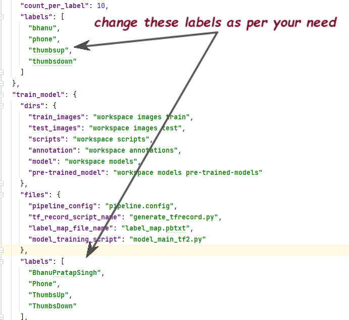
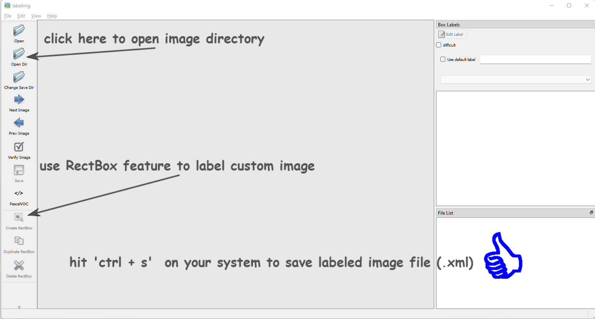
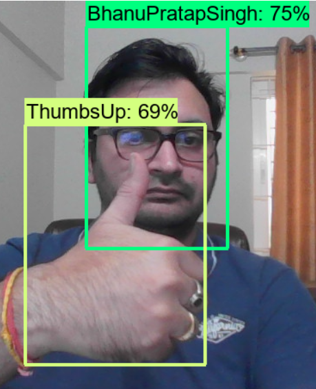
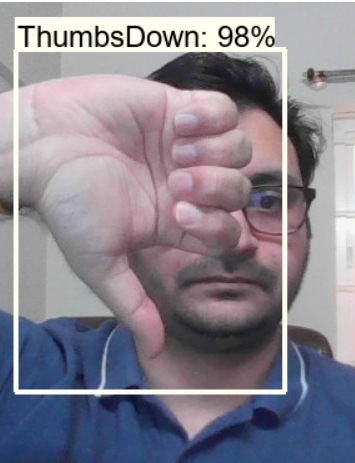
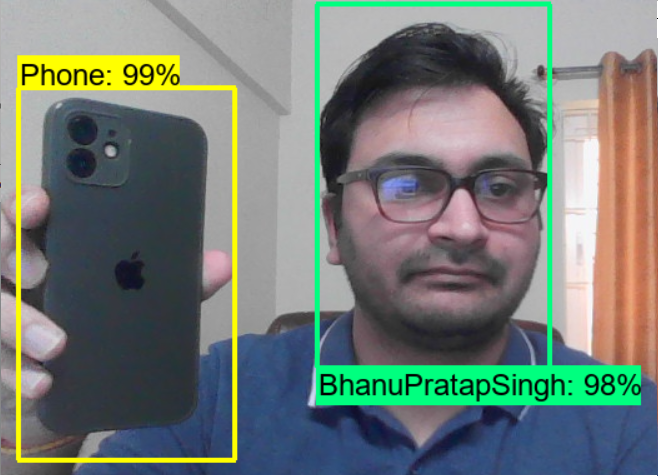

# Custom Object Detection using TFOD 2.0 API
Use Transfer Learning to create custom object detection model

## About Project Usages
**<u>Prerequisite</u>**
- You should have python/anaconda installed in your system.
- Your should have TFOD 2.0 setup in your system in order to make this project work. Use this link to complete the setup [click here](https://tensorflow-object-detection-api-tutorial.readthedocs.io/en/latest/install.html)

For app_config.json, make these changes

For labeling images, use this,

To install `labelimg`, use this command: `pip install labelimg'

## Object Detection Results
 |  |  |    
|--|--|--|--|
