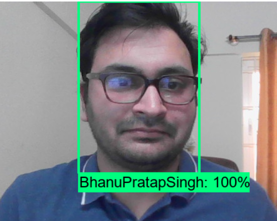

# Custom Object Detection using TFOD 2.0 API
Use Transfer Learning to create custom object detection model

## About Project Usages
<u>**Pre-requisit**</u>

## Object Detection Results
 |  |  |    
|--|--|--|--|
